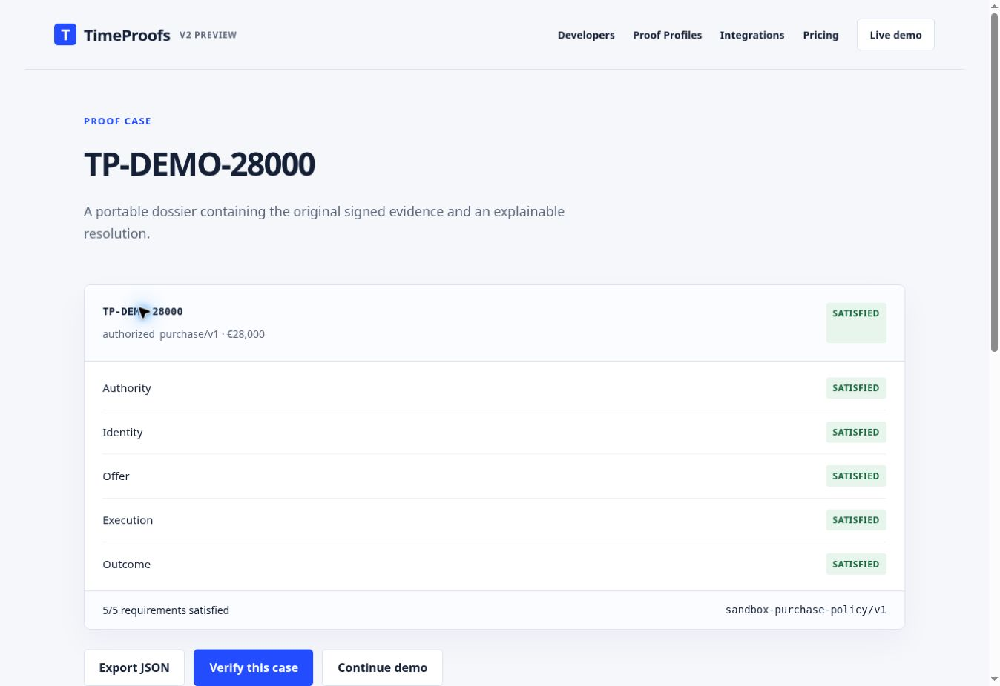
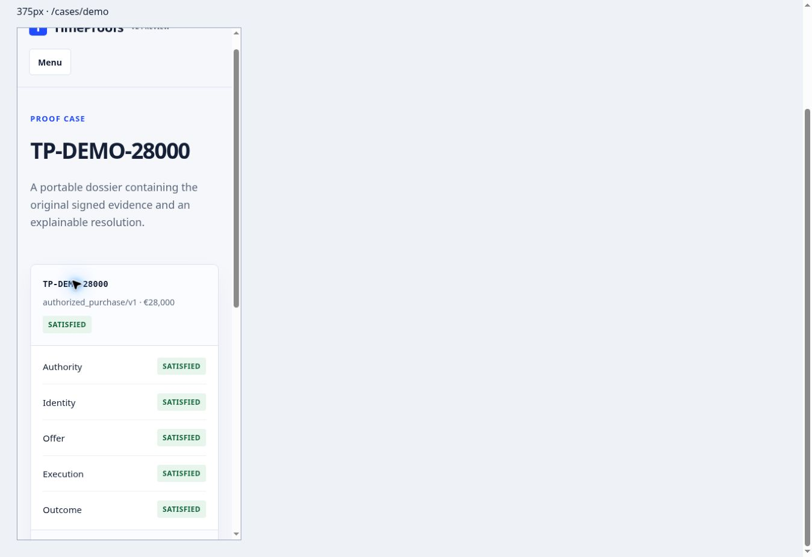

# TIMEPROOFS V2 ALPHA READINESS

Date: 2 October 2026. Verdict applies to the bounded, public **sandbox reference alpha**, not a managed production service. No real purchase, payment, connected merchant or legal decision is claimed.

## Result

| Area | Result and boundary |
| --- | --- |
| Core | PASS — deterministic checks; all 33 automated tests pass. |
| Resolver | PASS — missing evidence requests, registered collectors, dependency order and re-evaluation. Public collectors return signed fixtures. |
| Proof Profiles | One executable `authorized_purchase/v1`; four versioned drafts explicitly UNSUPPORTED. |
| Proof Cases | PASS — portable JSON, original signed artifacts, action binding and explainable requirement results. The case identifier is a label, not a separately signed envelope. |
| Verification | PASS — signatures and recorded decisions recomputed using independently pinned policy and current time. SATISFIED does not establish truth, legality, compliance or admissibility. |
| Tamper resistance | PASS for modified amount, modified signed evidence, missing required field and forged recorded decisions. |
| API | PASS — deployed public smoke tests; authenticated self-host case operations tested locally. Private managed API remains disabled in the public preview. |
| SDK | PASS — clean tarball install, offline resolver/verifier, deployed HTTP client and clean HTTPS clone → pack → install. npm registry publication remains pending. |
| CLI | PASS — installed profiles, demo, resolve, downloaded-case verification, and INVALID exit code 1 for tampering. |
| Desktop | PASS — 12 public page/view checks at browser viewport 1363 px, document content width 1348 px; no page overflow. |
| Mobile | PASS — all eight priority pages at 375, 390 and 430 px; navigation and 3/5 → 4/5 → 5/5 → Verify at each width. These are actual Chrome iframe CSS viewports, not physical-device/Safari tests. |
| Export/import | PASS — actual browser attachment download, actual file chooser import, JSON Schema validation, integrity verification and unchanged SATISFIED status. |
| Documentation | PASS — canonical English, explicit boundaries, clearer definitions and verified package-install instructions. Comprehension review is editorial, not a timed user study. |
| Security | Suitable for restricted sandbox testing; threat model, pinned public keys, rotation/revocation checks, input limits and adversarial tests present. Managed operational protections remain production blockers. |
| Integrations | Ed25519 compact JWT/JWS and limited VC-JWT 1.1 are TESTED SUBSET. MCP, A2A, AP2, SCITT, x401 and receipt integrations remain PLANNED. |
| Pricing | Public verification remains free. 0/49/199/799 EUR and Enterprise are hypotheses; no billing or production SLA. |
| Vercel preview | Separate immutable preview, READY, target preview. Visible branding is TimeProofs V2 Preview. Console project rename requires the owner's authenticated account. |

**P0:** None observed in the tested reference-alpha scope.

**P1:** None remaining in the tested reference-alpha scope. Fixed long profile-heading overflow, incomplete envelope validation, requested profile URL redirect, and unconfirmed Blob download workflow.

**P2:** Manual Vercel console rename; physical-device/Safari coverage; npm publication; independent outside-developer reproduction; timed new-visitor comprehension and paid-use validation. Automated HTTP fetching of two external specification sites returned 403; both specification pages were retrieved through web search. Do not interpret that as an integration test.

**Final verdict: ALPHA READY.** Production remains NO-GO: multi-instance durable storage, tenant isolation, distributed abuse protection, operational monitoring/backups, cross-case replay prevention and real external acquisition need separate work and validation.

## Acceptance evidence

Release preview and source identifiers are recorded in the final acceptance appendix of [verification.md](verification.md).

- `npm run check`: 33/33, including conformance/adversarial checks and SDK/HTTP/private-storage integration. Vercel's configured build command runs these checks.
- Reference CLI and browser: Authority / Identity / Offer initially SATISFIED, Execution / Outcome MISSING; collect execution and outcome; 5/5 SATISFIED; independent verification SATISFIED.
- Desktop routes: `/`, `/demo`, `/developers`, `/profiles`, `/profiles/authorized-purchase-v1` (redirects to `/profiles/authorized_purchase/v1`), `/verify`, `/pricing`, `/integrations`, `/cases/demo`, `/docs`, `/security`, `/about`.
- Mobile matrix: the first eight routes above × 375/390/430 px = 24 loaded-page checks. At each width document scroll width equals client width. Code and tables scroll within focusable containers; keyboard horizontal scrolling exercised. Buttons and primary/navigation targets have at least 44 px dimensions. Pricing badge wrapping and Proof Case spacing inspected visually. Supplementary case viewer checked at 375 px.
- Responsive harness exists only on `timeproofs-v2-mobile-qa`. Release keeps `X-Frame-Options: DENY` and `frame-ancestors 'none'`; the isolated QA branch permits same-origin framing of its fixture-only app. Do not promote the QA branch.
- Export uses a validated HTTP attachment rather than an unconfirmed Blob event. Downloaded file: 19,788 bytes, `TP-DEMO-28000`, five signed artifacts, recorded SATISFIED. The exact browser-returned file was reimported through the file chooser after navigating to Verify and clearing the input. Draft 2020-12 JSON Schema validated that file; the installed CLI also independently verified it.

| Downloaded-file variant | Browser import result |
| --- | --- |
| Unchanged | SATISFIED, independently valid |
| Amount changed to 29,000 EUR | INVALID |
| Signed evidence payload modified | INVALID |
| Required action merchant removed | INVALID |
| Malformed JSON | Clean rejection: Invalid JSON |

Missing evidence in a freshly recomputed well-formed case can produce INCOMPLETE. Removing a required schema field is malformed and produces INVALID. An old export can also fail verification after expiration, revocation or trust-policy change; this is intentional.

- Live API: health, profiles, exact profile, adapters, demo policy, stage 0 and stage 2, positive Verify, three tampered Verify inputs, malformed JSON HTTP 400, and unconfigured private API HTTP 503. Release response framing protection confirmed DENY.
- SDK: `npm pack` → empty application directory → `npm install --offline` → offline resolver/verifier and deployed HTTP client. A separate HTTPS shallow clone of the public V2 branch was packed and installed into another empty application; installed demo passed. Direct npm Git shortcut failed when npm attempted SSH in this environment; README and Developers now use the verified clone-and-package route.
- Link check: 20 internal URLs including assets/API/profile drafts returned HTTP 200 after expected redirects; seven external URLs returned HTTP 200. AP2 and x401 HTTP fetches returned 403, while their exact linked specification pages were retrieved through web search. No confirmed broken internal link remains.
- Production project and legacy branch were inspected read-only after testing. No production promotion, DNS/domain write or legacy edit occurred.

## New visitor review

| Question | Where the answer is visible |
| --- | --- |
| What is TimeProofs? | Home headline and proof-orchestration description. |
| Why does an agent need it? | Home explains evidence of authority, agreement and outcome. |
| What is a Proof Profile? | Home's versioned-checklist definition and public profile requirements. |
| What does the Evidence Resolver do? | Home definition and demo's explicit missing-evidence requests/collection steps. |
| What is a Proof Case? | Home dossier definition, case viewer and export. |
| Why are logs/a receipt different? | Home's comparison of event records with profile sufficiency and artifact linkage. |
| What does SATISFIED mean? | Home boundary, persistent footer and Security. No truth/compliance promise. |
| How do I try it? | Home's Run the purchase demo action. |
| How do I integrate? | Developers' verified source installation, collector example, API and CLI docs. |
| What is supported now? | Home availability statement and Integrations' TESTED SUBSET/PLANNED labels. |

## Exact manual Vercel rename

The connector provides read access but no project rename operation. Project settings redirect the available browser session to sign-in. No rename was claimed or attempted using another project's settings.

1. In your own signed-in Vercel account, select team **jeason1**.
2. Open project **timeproofs**. In **Settings → General**, confirm Project ID **prj_Su1mpb1PRYZEFCTTZs2L97LW5o82**.
3. Change **Project Name** to **timeproofs-v2-preview**, save, and confirm the successful update.
4. Do not modify Domains, DNS, production branch, or promote a preview. Do not select **timeproofs-site**, **timeproofsv1**, or **timeproofs1**.

Official instructions: [Vercel: change a project's name](https://vercel.com/kb/guide/how-do-i-change-the-name-of-my-vercel-project).

## Browser evidence

